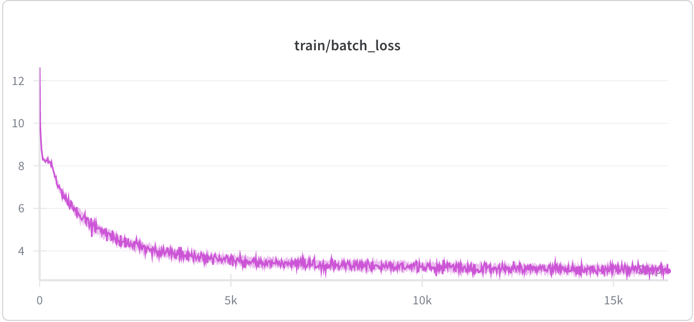

# llm-siciliano-vero

Un LLM trainato con dati italiani al 100% (perché sono un patriota vero, un italiano vero) per poi farlo diventare un siciliano vero, visto che finalmente ho potuto acquistare una bella RTX PRO 6000. BTW - vedi [Il percorso](#il-percorso) per un po' di contesto sul progetto.

## Dataset

Il dataset di base proviene da:

- https://www.corpusitaliano.it/

Questa fonte raccoglie testi in italiano che verranno utilizzati per costruire il corpus di addestramento. Il progetto mira a mantenere un dataset italiano puro e rappresentativo.

Come riferimento per ampliare il corpus con più dati grezzi in italiano:

- https://dumps.wikimedia.org/itwiki/ (dump completo di Wikipedia in italiano)

Lo snapshot di Wikipedia italiana è uno dei corpus in lingua italiana più grandi e variegati disponibili gratuitamente. Puoi scaricare il dump `pages-articles` e processarlo con tool come `wikiextractor` per estrarre il testo pulito da aggiungere alla cartella `data/`.

## Come usarlo

### Installare dipendenze e dataset

Assicurati di avere installati Python **3.12**, `curl` e `gzip`. Dalla cartella principale del progetto, crea e attiva un virtualenv con Python 3.12:

```bash
uv venv --python 3.12 .venv
source .venv/bin/activate
```

Se non usi `uv`, crea un virtualenv con il tuo Python 3.12:

```bash
python3.12 -m venv .venv
source .venv/bin/activate
```

Installa quindi PyTorch **2.8.0** manualmente scegliendo la variante adatta al tuo sistema:

#### macOS (Apple Silicon / MPS)

```bash
pip install torch==2.8.0 torchvision==0.23.0
```

#### Linux + NVIDIA (CUDA 12.8)

```bash
pip install torch==2.8.0 torchvision==0.23.0 --index-url https://download.pytorch.org/whl/cu128
```

#### CPU-only (Linux/Windows senza GPU)

```bash
pip install torch==2.8.0 torchvision==0.23.0
```

Infine installa le restanti dipendenze:

```bash
pip install -r requirements.txt
```

Le varianti di PyTorch sono alternative e non vanno usate insieme. Su macOS non esiste CUDA: si usa il backend **MPS** (verifica con `python -c "import torch; print(torch.backends.mps.is_available())"`). L'index `cu128` contiene solo wheel Linux.

Scarica quindi il dataset ed estrai il corpus principale nella cartella `data/`:

```bash
bash scripts/init.sh
```

Lo script scarica gli archivi PAISA e decomprime `paisa.raw.utf8` direttamente in `data/`. Può essere eseguito dalla cartella principale del progetto o da un'altra directory.

### Preparare manualmente i dati (opzionale)

Se non usi lo script di inizializzazione, metti i file di testo in `data/` con estensione `.utf8` e assicurati che il contenuto sia italiano. I file `.parquet` (es. dump di Wikipedia) vanno posizionati in una sottocartella di `data/` (es. `data/20231101.it/`).

### Addestrare il tokenizer (consigliato)

Prima di allenare il modello, genera un tokenizer BPE addestrato sul tuo corpus italiano.Questo produce token più efficienti per l'italiano rispetto al tokenizer GPT-2 (che è ottimizzato per l'inglese) e include già i token speciali per la chat.

```bash
python train_tokenizer.py
```

Opzioni disponibili:

```bash
mkdir -p models/
python train_tokenizer.py --vocab-size 50257 --data-dir data/ --output models/tokenizer.json
```

Il tokenizer viene salvato in `models/tokenizer.json` e viene caricato automaticamente da `lib/tokenizer.py` in tutti gli script del progetto. Durante l'addestramento del tokenizer vedrai barre di avanzamento per la lettura del corpus e le fasi interne del BPE (pre-processing, tokenize words, count pairs, compute merges).

Se non addestri un tokenizer personalizzato, il progetto usa il fallback GPT-2 automaticamente.

### Allenare il modello

Dopodiché avvia il training:

```bash
python train_transformer.py
```

Questo script:

- carica il tokenizer (quello personalizzato in `models/tokenizer.json` se presente, altrimenti GPT-2)
- carica il dataset italiano (con barre di avanzamento su lettura e tokenizzazione)
- crea blocchi di token per l'addestramento, con cache su disco keyed per fingerprint dei dati e dimensione del vocabolario
- calcola la loss sulla predizione del token successivo
- salva i checkpoint in `models/`, compreso `models/best_model.safetensors` e `models/final_model.safetensors`, insieme a `models/config.json` (l'architettura completa, inclusa la variante MoE)

Come riferimento, la loss del primo training di test (dense, 24 layer):



### Allenare una variante MoE

L'architettura si sceglie con `--arch` (default `dense`). Per addestrare una variante Mixture-of-Experts, dove la FFN di ogni blocco diventa un router top-k su più esperti:

```bash
python train_transformer.py --arch moe
```

Opzioni MoE (con default già ragionevoli, stile Mixtral):

```bash
python train_transformer.py --arch moe \
    --num-experts 8 \
    --num-experts-per-tok 2 \
    --moe-aux-loss-coeff 0.01
```

- `--num-experts`: numero di esperti paralleli per blocco.
- `--num-experts-per-tok`: quanti esperti vengono attivati per ogni token (top-k).
- `--moe-aux-loss-coeff`: peso della loss ausiliaria di load-balancing, che spinge il router a distribuire i token in modo uniforme tra gli esperti.

Il `config.json` salvato contiene `"arch": "moe"` con i relativi parametri, quindi `app.py` ricostruisce la variante corretta in automatico. I checkpoint `dense` già esistenti continuano a caricarsi senza modifiche.

### Generare testo

```bash
python app.py
```

Questo script carica il modello salvato e il tokenizer, legge l'architettura dal `config.json` accanto al checkpoint (dense o MoE), ridimensiona gli embedding per includere i token speciali (se necessario) e genera testo a partire da un prompt usando top-k, top-p e repetition penalty.

Puoi passare esplicitamente checkpoint, config, tokenizer e parametri di generazione:

```bash
python app.py \
    --checkpoint models/best_model.safetensors \
    --config models/config.json \
    --prompt "Ciao, come stai?" \
    --max-new-tokens 128 \
    --temperature 0.7 \
    --top-p 0.9 \
    --repetition-penalty 1.2
```

## Il percorso

L'obiettivo non è fare tutto in una botta sola: è far crescere il modello un pezzetto alla volta. 

1. **Pre-training** *(in corso)* — il modello legge tantissimo italiano grezzo e impara la lingua: le parole, la grammatica, un po' di mondo. È il fondamento di tutto.
2. **SFT conversazionale** — dopo il pre-training, gli insegniamo a fare conversazione: gli mostriamo migliaia di dialoghi (chi parla, chi ascolta, come si risponde) finché non impara a tenere botta da solo.
3. **SFT in siciliano** — stessa cosa del punto 2, ma con conversazioni in siciliano. È qui che comincia a farsi l'orecchio (e la bocca) siciliana.
4. **Allineamento con un LLM insegnante** — l'ultimo passo, il più delicato: un LLM più esperto gli fa da maestro e gli insegna a essere un *vero* siciliano. Non solo la lingua, ma l'atteggiamento, il tono, i modi di dire. Questo allineamento può usare tecniche supervisionate (SFT/DPO) dove l'insegnante gli fa da guida e da giudice.

A ogni tappa confrontiamo il modello con quello della tappa precedente: se non migliora, torniamo sui dati e ricominciamo.

### Cose in programma

- confrontare la variante MoE (`--arch moe`) con quella densa e scegliere la migliore
- preparare il dataset conversazionale italiano per la SFT
- raccogliere conversazioni siciliane (o tradurle con attenzione)
- impostare il primo allineamento con un LLM insegnante

## Nota

Per ora il modello è un piccolo esperimento locale: stiamo imparando a costruire e addestrare un LLM in italiano, senza fretta e senza pretese. Il focus è capire la pipeline di training, i dati e la generazione testuale, prima di buttarci sulla conversazione e sul siciliano.
E ovviamente questo è un progetto ironico: ma il percorso per farlo parlare siciliano è serio.